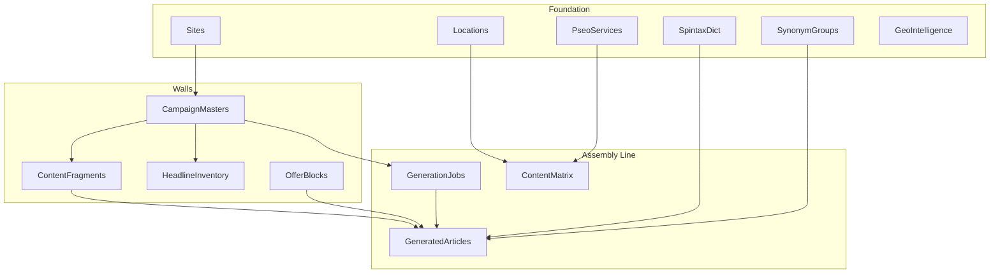

# God Mode Factory — How Components Work Together

Programmatic SEO model: apply a **content template** to a **dataset** to create pages at scale. The factory multiplies locations × services into target pages, assembles articles from fragments, and enforces uniqueness.

---

## Architecture



---

## Programmatic SEO Model

1. **Template** — article structure (H1, sections, CTA)
2. **Dataset** — location × service combos (content_matrix)
3. **Output** — one page per combo (e.g. "Plumbing Emergency in Austin, TX")

Example: 20 locations × 25 services = 500 target pages.

---

## X-Axis: Locations

`locations` table: city, state, zip, slug (e.g. `austin-tx`).

- Defines geographic targets
- Multiplies with pseo_services to form content_matrix

---

## Y-Axis: pseo_services

`pseo_services` table: service_type, sub_niche, slug (e.g. `plumbing-emergency-repair`).

- Defines niches
- Multiplies with locations → content_matrix rows

---

## Content Matrix

`content_matrix` = locations × pseo_services.

- One row per (location, service) combo
- slug: `{location-slug}-{service-slug}`
- title, meta_description for SEO
- Worker uses content_matrix to know which pages to generate

---

## Uniqueness Engine

Generated articles must hit **80% uniqueness** (worker enforced).

- **spintax_dictionaries** — interchangeable phrases (urgency, trust, CTA)
- **synonym_groups** — interchangeable terms for variation
- Without these, jobs may fail or produce duplicate content

---

## Building Blocks

- **content_fragments** — reusable paragraphs per campaign
- **headline_inventory** — headline pool per campaign
- **offer_blocks** — CTA / lead capture blocks (forms, buttons)

Articles are assembled from these blocks + spintax + synonyms.

---

## Campaigns

`campaign_masters` links a site to:
- headline_spintax_root (H1 template)
- target_word_count (default 1500)
- content_fragments, headline_inventory

---

## Generation Job Flow

1. Create `generation_job` (site_id, campaign_id, target_quantity)
2. Worker reads jobs, pulls content_matrix rows
3. Worker assembles articles using fragments, headlines, spintax, synonyms
4. Articles land in `generated_articles`
5. Approve / publish → route to tenant front-end

---

## Lead Capture

Each article page should include:
- Lead form posting to `/api/submit-lead`
- source = tenant domain (e.g. chrisamaya.work)
- offer_blocks provide CTA content

---

## Geo Intelligence

`geo_intelligence` — optional but powerful for localized content.

- cluster_key (e.g. `austin-tx`)
- data: city, state, county, landmark, latitude, longitude
- Injects local landmarks and geography into content

---

## chrisamaya.work v4 (2000-Word Survey Factory)

The `seed_chrisamaya_v4.py` script seeds the full chrisamaya.work campaign:

- **50 locations** × **35 B2B tech services** = **1,750 content_matrix slugs**
- **22 synonym groups** (12–25 terms each), **18 spintax dictionaries**
- **72+ content_fragments** across 15 types (intro_hook, hero_section, problem_agitation, methodology, technical_benefits, case_study_teaser, geo_bridge, social_proof, results_quantified, faq_section, survey_cta_inline, conclusion, final_cta, objection_handler, pricing_teaser)
- **42+ headline_inventory** (h1/h2/h3 with spintax)
- **18 offer_blocks** (unicorn readiness survey, AI audit, Zapier scorecard, Unicorn Day, etc.)
- Campaign: `headline_spintax_root`, `target_word_count=2000`, `uniqueness_target=82`

To launch the first campaign:

```bash
cd god-mode/python-api && python scripts/launch_chrisamaya_campaign.py --quantity=2000
```

---

## See Also

- [TENANT_PSEO_CHECKLIST.md](./TENANT_PSEO_CHECKLIST.md) — readiness checklist
- [API_REFERENCE.md](./API_REFERENCE.md) — Swagger, ReDoc, endpoint status
