# God Mode Harris Matrix

Single source of truth for schema, admin pages, API endpoints, and their interconnectivity across 83+ admin pages.

**Related docs:** [TECH_STACK.md](./TECH_STACK.md) | [CODEBOOK.md](./CODEBOOK.md) | [OPERATIONS_MANUAL.md](./OPERATIONS_MANUAL.md) | [DOMAIN_LAUNCH_GUIDE.md](./DOMAIN_LAUNCH_GUIDE.md)

## 1. Schema Dependency Diagram

```mermaid
flowchart TD
    subgraph foundation [Foundation - No Dependencies]
        sites[sites]
        avatar_intelligence[avatar_intelligence]
        avatar_variants[avatar_variants]
        geo_intelligence[geo_intelligence]
        cartesian_patterns[cartesian_patterns]
        spintax_dictionaries[spintax_dictionaries]
        offer_blocks[offer_blocks]
        page_blocks[page_blocks]
        synonym_groups[synonym_groups]
    end

    subgraph walls [Walls - Depend on sites or campaign_masters]
        campaign_masters[campaign_masters]
        generation_jobs[generation_jobs]
        generated_articles[generated_articles]
        pages[pages]
        posts[posts]
        headline_inventory[headline_inventory]
        content_fragments[content_fragments]
    end

    subgraph analytics [Analytics - Depend on sites]
        events[events]
        pageviews[pageviews]
        conversions[conversions]
    end

    subgraph system [System]
        scheduled_tasks[scheduled_tasks]
        work_log[work_log]
    end

    subgraph assembly [Assembly Line]
        article_usage[article_usage]
        content_refresh_schedule[content_refresh_schedule]
    end

    subgraph existing [Existing - Preserved]
        leads[leads]
        scaling_survey_submissions[scaling_survey_submissions]
        api_logs[api_logs]
        locations[locations]
        pseo_services[pseo_services]
        content_matrix[content_matrix]
    end

    sites --> campaign_masters
    sites --> generation_jobs
    sites --> generated_articles
    sites --> pages
    sites --> posts
    sites --> events
    sites --> pageviews
    sites --> conversions
    sites --> work_log
    campaign_masters --> headline_inventory
    campaign_masters --> content_fragments
    campaign_masters --> generated_articles
    leads --> conversions
    generated_articles --> article_usage
    sites --> content_refresh_schedule
    campaign_masters --> content_refresh_schedule
```

## 2. Table List (Columns and FKs)

| Table | Key Columns | Foreign Keys |
|-------|-------------|--------------|
| leads | id (SERIAL), source, name, email, phone, data_json | (existing) |
| scaling_survey_submissions | id, name, email, company, raw_data | (existing) |
| api_logs | id, endpoint, method, status, payload | (existing) |
| locations | id, city, state, zip, slug | (existing) |
| pseo_services | id, service_type, sub_niche, slug | (existing) |
| content_matrix | id, location_id, service_id, slug, title, content_json | (existing) |
| sites | id (UUID), name, url, status | - |
| avatar_intelligence | id, avatar_key, base_name, data | - |
| avatar_variants | id, avatar_key, variant_type, data | - |
| geo_intelligence | id, cluster_key, data | - |
| cartesian_patterns | id, pattern_key, pattern_type, data | - |
| spintax_dictionaries | id, category, data | - |
| offer_blocks | id, block_type, avatar_key, data | - |
| page_blocks | id, block_type, name, data | - |
| synonym_groups | id, category, terms | - |
| campaign_masters | id, site_id, name, headline_spintax_root | site_id -> sites |
| generation_jobs | id, site_id, campaign_id, target_quantity, progress, source_type | site_id, campaign_id |
| generated_articles | id, site_id, campaign_id, status, title, slug, uniqueness_score | site_id, campaign_id |
| pages | id, site_id, title, slug, content | site_id |
| posts | id, site_id, title, slug, content | site_id |
| headline_inventory | id, campaign_id, final_title_text, used_on_article | campaign_id, used_on_article |
| content_fragments | id, campaign_id, fragment_type, content_body | campaign_id |
| events | id, site_id, event_name, page_path | site_id |
| pageviews | id, site_id, page_path, session_id | site_id |
| conversions | id, site_id, lead_id, conversion_type | site_id, lead_id -> leads |
| scheduled_tasks | id, site_id, campaign_id, task_type, scheduled_at | site_id, campaign_id |
| work_log | id, site_id, action, entity_type, details | site_id |
| article_usage | id, article_id, component_type, component_id | article_id -> generated_articles |
| content_refresh_schedule | id, site_id, campaign_id, schedule_cron | site_id, campaign_id |

## 3. Page -> API -> Table Matrix

| Admin Page | API Endpoint(s) | Table(s) | Notes |
|------------|-----------------|----------|-------|
| admin/index | /api/leads, /api/scaling-surveys, /api/locations, /api/pseo-services, /api/content-matrix | leads, scaling_survey_submissions, locations, pseo_services, content_matrix | Dashboard stats |
| admin/leads | /api/leads | leads | Leads list |
| admin/scaling-surveys | /api/scaling-surveys | scaling_survey_submissions | Survey submissions |
| admin/locations | /api/locations (GET, POST, DELETE) | locations | pSEO locations CRUD |
| admin/pseo-services | /api/pseo-services | pseo_services | pSEO services CRUD |
| admin/content-matrix | /api/content-matrix | content_matrix | pSEO matrix |
| admin/debug | /api/debug | api_logs, config | Debug panel |
| admin/status | /api/health | (no table) | Health check |
| admin/analytics/index | /api/analytics/summary | events, pageviews, conversions | Analytics overview |
| admin/analytics/events | /api/events | events | Events list |
| admin/analytics/pageviews | /api/pageviews | pageviews | Pageviews list |
| admin/analytics/conversions | /api/conversions | conversions | Conversions list |
| admin/intelligence/index | /api/counts | avatar_intelligence, avatar_variants, geo_intelligence, spintax_dictionaries, cartesian_patterns | Intelligence counts |
| admin/intelligence/avatars | /api/avatar-intelligence | avatar_intelligence | Avatar list |
| admin/intelligence/variants | /api/avatar-variants (GET, POST, DELETE) | avatar_variants | Variants CRUD |
| admin/intelligence/geo | /api/geo-intelligence | geo_intelligence | Geo list |
| admin/intelligence/spintax | /api/spintax-dictionaries | spintax_dictionaries | Spintax list |
| admin/intelligence/patterns | /api/cartesian-patterns (GET, POST, DELETE) | cartesian_patterns | Patterns CRUD |
| admin/collections/index | /api/counts | page_blocks, offer_blocks, headline_inventory, content_fragments | Collections counts |
| admin/collections/content-fragments | /api/content-fragments (GET, POST, DELETE) | content_fragments | Fragments CRUD |
| admin/collections/headline-inventory | /api/headline-inventory | headline_inventory | Headlines list |
| admin/collections/offer-blocks | /api/offer-blocks | offer_blocks | Offer blocks list |
| admin/collections/page-blocks | /api/page-blocks | page_blocks | Page blocks list |
| admin/factory/index | /api/generation-jobs | generation_jobs | Factory Kanban queue |
| admin/factory/articles | /api/generated-articles | generated_articles | Generated articles |
| admin/content-factory | /api/generation-jobs (POST) | generation_jobs | Launch jobs |
| admin/scheduler/index | /api/scheduled-tasks (GET, POST, DELETE) | scheduled_tasks | Scheduler CRUD |
| admin/seo/campaigns | /api/campaign-masters (GET, POST, DELETE) | campaign_masters | Campaigns CRUD |
| admin/sites/index | /api/sites | sites | Sites list |
| admin/pages/index | /api/pages | pages | Pages list |
| admin/posts/index | /api/posts | posts | Posts list |
| admin/system/index | /api/health | (no table) | System status |
| admin/system/work-log | /api/work-log | work_log | Work log |
| admin/testing/index | /api/health | (no table) | Testing hub |
| admin/testing/connection | /api/health | (no table) | Connection test |
| admin/testing/schema | /api/debug | api_logs | Schema debug |

## 4. Verification Checklist

- [ ] Run `run_schema()` - schema applies without error
- [ ] All 83 admin pages load without "API error" or empty lists
- [ ] Dashboard stats show real counts (0 when empty, not "?")
- [ ] Factory, Intelligence, Collections, SEO, Scheduler, Analytics, System pages read from their tables

## 5. Assembly-Line Flows

| Capability | API | Table(s) |
|------------|-----|----------|
| Bulk delete articles | POST /api/generated-articles/bulk-delete | generated_articles |
| Move article to station | PATCH /api/generated-articles/{id} (status) | generated_articles |
| Create generation job | POST /api/generation-jobs | generation_jobs |
| Track component usage | article_usage | article_usage |

## 6. Generation Pipeline (New, Re-Do, 1000-Page)

| API | Purpose |
|-----|---------|
| POST /api/generation-jobs | Create job: site_id, target_quantity (up to 1000), campaign_id |
| POST /api/generation-jobs (source_type: redo) | Re-process existing articles via source_article_ids |

## 7. Uniqueness and Readability (80% Rule)

| Field | Table | Purpose |
|-------|-------|---------|
| uniqueness_score | generated_articles | Must be >= 80; enforced by worker |
| readability_score | generated_articles | Flesch-Kincaid or similar |
| synonym_groups | synonym_groups | Controllable synonym levers |
| spintax_dictionaries | spintax_dictionaries | Spin tags for variation |

## 8. Auto-Rotation (No Human Check)

| Table | Purpose |
|-------|---------|
| content_refresh_schedule | Cron, min_age_days, refresh_mode (light/full/meta_only) |
| generated_articles.last_refreshed_at | Track when content was last refreshed |
| generated_articles.refresh_count | Number of auto-refreshes |

Worker reads content_refresh_schedule, queues redo jobs for stale articles, updates last_refreshed_at and refresh_count. Fully automated.
