# God Mode — Operations Manual

Day-to-day procedures, deployment, verification, and troubleshooting. Companion to [HARRIS_MATRIX.md](./HARRIS_MATRIX.md) and [TECH_STACK.md](./TECH_STACK.md).

---

## 1. Pre-Deploy Checklist

- [ ] Schema applied (`POST /api/run-schema` or `run_schema()` locally)
- [ ] `DATABASE_URL` set in god-mode-api (Coolify env vars)
- [ ] `ADMIN_KEY` set for both JFactory and god-mode-api (same value)
- [ ] `GOD_MODE_API_URL=https://api.jumpstartscaling.com` in JFactory env
- [ ] DNS records point to Coolify server (factory, www.factory, chrisamaya.work, api)

---

## 2. Deployment Procedure

### 2.1 Push to GitHub

```bash
cd /path/to/spark
git add -A
git status   # Ensure .env.local not staged
git commit -m "Descriptive message"
git push spark main
```

### 2.2 Configure and Deploy via Coolify API

```bash
cd god-mode
# COOLIFY_TOKEN from Coolify → Keys & Tokens
COOLIFY_TOKEN=xxx node scripts/configure-coolify-via-api.mjs --deploy
```

Or configure only (no deploy):

```bash
node scripts/configure-coolify-via-api.mjs
```

### 2.3 Deploy Specific Branch (JFactory)

```bash
JFACTORY_BRANCH=fix/your-branch node scripts/configure-coolify-via-api.mjs --deploy
```

### 2.4 Manual Deploy (Coolify UI)

1. Coolify → JFactory → Deploy
2. Coolify → god-mode-api → Deploy

---

## 3. Schema Management

### 3.1 Apply Schema (Remote)

```bash
curl -X POST "https://api.jumpstartscaling.com/api/run-schema" \
  -H "X-Admin-Key: YOUR_ADMIN_KEY"
```

Or with query param:

```bash
curl -X POST "https://api.jumpstartscaling.com/api/run-schema?key=YOUR_ADMIN_KEY"
```

### 3.2 Apply Schema (Local)

```bash
cd god-mode/python-api
# Set DATABASE_URL (e.g. via .env or SSH tunnel)
python -c "
from app.db.connection import run_schema
import asyncio
asyncio.run(run_schema())
"
```

### 3.3 Schema File

Location: `god-mode/python-api/app/db/schema.sql`  
Order: Foundation → Walls → Analytics → System → Assembly Line (per Harris Matrix)

---

## 4. Verification

### 4.1 Health Checks

| Endpoint | Expected |
|----------|----------|
| `GET https://factory.jumpstartscaling.com/health` | `{"status":"ok","service":"jfactory-router"}` |
| `GET https://api.jumpstartscaling.com/health` | `{"status":"ok"}` |

### 4.2 Admin Pages Load

- [ ] `https://factory.jumpstartscaling.com/jumpstart/admin` — admin dashboard
- [ ] `https://factory.jumpstartscaling.com/chrisamaya` — chrisamaya site
- [ ] `https://api.jumpstartscaling.com/admin/leads` — leads HTML
- [ ] `https://api.jumpstartscaling.com/api/counts` — JSON counts

### 4.3 Dashboard Stats

- [ ] Counts show numbers (0 when empty, not "?")
- [ ] No "API error" or blank lists on admin pages

---

## 5. Troubleshooting

### 5.1 "No Available Server" (503)

**Cause:** Traefik can’t find healthy containers.

**JFactory:**
1. Port must be 8100 (Coolify → JFactory → Configuration → Advanced)
2. Optionally disable Health Check (Configuration → Health Check → Off)
3. Restart proxy: Coolify → Servers → [Server] → Proxy → Restart Proxy
4. Verify container: `docker run -p 8100:8100 <image>` then `curl http://localhost:8100/health`

**god-mode-api:**
1. Check container logs for crash (Coolify logs or `docker logs <container>`)
2. Ensure DATABASE_URL is set if DB routes are used
3. Disable Health Check if it fails; app can start without DB
4. Restart proxy

### 5.2 ERR_MODULE_NOT_FOUND: Cannot find package 'react'

**Cause:** chrisamaya SSR runs but `node_modules` (React, etc.) not in final image.

**Fix:** Dockerfile must copy chrisamaya node_modules:

```dockerfile
COPY --from=builder-js /app/sites/chrisamaya/node_modules ./sites/chrisamaya/node_modules
```

Verify `start.sh` runs from `/app/sites/chrisamaya` so Node resolves `./node_modules`.

### 5.3 404 on /admin/

1. `GOD_MODE_API_URL` set in JFactory env
2. god-mode-api deployed and healthy at api.jumpstartscaling.com
3. Use `/jumpstart/admin` or `/admin` as configured in router

### 5.4 Database 503

- `DATABASE_URL` missing or wrong in god-mode-api
- Create Postgres in Coolify (Add Resource → Database), copy connection string
- Or run without DB: API starts; DB routes return 503

### 5.5 Build Fails (Docker)

- Check base directory: JFactory = `god-mode`, god-mode-api = `god-mode/python-api`
- Ensure `Dockerfile` exists in base dir
- Check GitHub branch (main vs feature branch)
- Inspect Coolify build logs for npm/python errors

---

## 6. Environment Variables

### JFactory

| Variable | Required | Purpose |
|----------|----------|---------|
| GOD_MODE_API_URL | Yes | https://api.jumpstartscaling.com |
| SITES_BASE_PATH | Yes | /app |
| ADMIN_KEY | Yes | Synced with god-mode-api |
| PUBLIC_N8N_WEBHOOK | No | n8n webhook URL |
| CHRISAMAYA_PORT | No | 8101 (default) |
| CHRISAMAYA_HOST | No | 0.0.0.0 |

### god-mode-api

| Variable | Required | Purpose |
|----------|----------|---------|
| DATABASE_URL | Recommended | PostgreSQL connection string |
| ADMIN_KEY | Yes | API/admin auth |
| PORT | No | 8200 (default) |
| LOG_REQUESTS | No | false (recommended) |
| ADMIN_USERNAME | No | Session login |
| ADMIN_PASSWORD | No | Session login |
| SESSION_SECRET | No | Change in production |
| DEBUG | No | false |

---

## 7. Assembly Line Operations

### Bulk Delete Articles

```bash
curl -X POST "https://api.jumpstartscaling.com/api/generated-articles/bulk-delete" \
  -H "Content-Type: application/json" \
  -H "X-Admin-Key: YOUR_ADMIN_KEY" \
  -d '{"ids":["uuid1","uuid2"]}'
```

### Create Generation Job

```bash
curl -X POST "https://api.jumpstartscaling.com/api/generation-jobs" \
  -H "Content-Type: application/json" \
  -d '{"site_id":"uuid","campaign_id":"uuid","target_quantity":100,"source_type":"new"}'
```

### Move Article to Station (PATCH)

```bash
curl -X PATCH "https://api.jumpstartscaling.com/api/generated-articles/{uuid}" \
  -H "Content-Type: application/json" \
  -d '{"status":"review"}'
```

---

## 8. Auto-Rotation (content_refresh_schedule)

| Field | Purpose |
|-------|---------|
| schedule_cron | Cron expression (e.g. `0 2 * * *` daily 2am) |
| refresh_mode | light, full, meta_only |
| min_age_days | Don’t refresh articles younger than this |
| is_active | Enable/disable schedule |

Worker (external) reads `content_refresh_schedule`, queues redo jobs, updates `last_refreshed_at` and `refresh_count`. Fully automated; no manual step required once configured.

---

## 9. Key File Locations

| Purpose | Path |
|---------|------|
| Schema | `python-api/app/db/schema.sql` |
| Coolify config | `scripts/configure-coolify-via-api.mjs` |
| JFactory config | `JFACTORY_COOLIFY_CONFIG.md` |
| Harris Matrix | `docs/HARRIS_MATRIX.md` |
| Tech Stack | `docs/TECH_STACK.md` |
| Codebook | `docs/CODEBOOK.md` |
# God Mode — Codebook

Definitions for tables, columns, status values, API conventions, and JSONB structures. Companion to [HARRIS_MATRIX.md](./HARRIS_MATRIX.md).

---

## 1. Status Enums

### generation_jobs.status

| Value | Meaning |
|-------|---------|
| `pending` | Job queued, not yet started |
| `running` | Worker is processing |
| `completed` | Finished successfully |
| `failed` | Error during processing |

### generated_articles.status

| Value | Meaning |
|-------|---------|
| `queued` | Waiting for generation |
| `drafting` | Generation in progress |
| `review` | Ready for human review |
| `approved` | Approved for publish |
| `published` | Live on site |
| `archived` | Hidden / removed from rotation |

### sites.status, campaign_masters.status

| Value | Meaning |
|-------|---------|
| `active` | In use |
| `inactive` | Paused or disabled |
| `draft` | Not yet live |

### scheduled_tasks.status

| Value | Meaning |
|-------|---------|
| `pending` | Scheduled, not run |
| `running` | Executing |
| `completed` | Done |
| `failed` | Error |
| `cancelled` | Cancelled |

### content_refresh_schedule.refresh_mode

| Value | Meaning |
|-------|---------|
| `light` | Minor edits, keep structure |
| `full` | Full regeneration |
| `meta_only` | Only meta_title, meta_description, schema_json |

---

## 2. Table Field Reference

### Foundation (no FKs to new tables)

| Table | Column | Type | Purpose |
|-------|--------|------|---------|
| **sites** | id | UUID | Primary key |
| | status | VARCHAR(50) | active, inactive, draft |
| | name | VARCHAR(255) | Display name |
| | url | VARCHAR(500) | Base URL |
| **avatar_intelligence** | avatar_key | VARCHAR(255) | Identifier for avatar |
| | base_name | VARCHAR(255) | Human-readable name |
| | wealth_cluster | VARCHAR(255) | Income/wealth segment |
| | business_niches | JSONB | Array of niches |
| | data | JSONB | Extra avatar attributes |
| **avatar_variants** | avatar_key | VARCHAR(255) | Links to avatar_intelligence |
| | variant_type | VARCHAR(100) | default, premium, etc. |
| | data | JSONB | Variant-specific overrides |
| **geo_intelligence** | cluster_key | VARCHAR(255) | Geo cluster identifier |
| | data | JSONB | Geo attributes |
| **cartesian_patterns** | pattern_key | VARCHAR(255) | Pattern identifier |
| | pattern_type | VARCHAR(100) | Pattern category |
| | data | JSONB | Pattern config |
| **spintax_dictionaries** | category | VARCHAR(255) | Spintax category |
| | data | JSONB | Array of spin options `[]` |
| **offer_blocks** | block_type | VARCHAR(100) | CTA, testimonial, etc. |
| | avatar_key | VARCHAR(255) | Optional avatar tie-in |
| | data | JSONB | Block content |
| **page_blocks** | block_type | VARCHAR(100) | Block type |
| | name | VARCHAR(255) | Block name |
| | data | JSONB | Block content |
| **synonym_groups** | category | VARCHAR(255) | Synonym category |
| | terms | JSONB | Array of interchangeable terms `[]` |

### Walls (depend on sites or campaign_masters)

| Table | Column | Type | Purpose |
|-------|--------|------|---------|
| **campaign_masters** | site_id | UUID FK | Parent site |
| | headline_spintax_root | TEXT | Root spintax template |
| | target_word_count | INTEGER | Default 1500 |
| | niche_variables | JSONB | Campaign variables |
| **generation_jobs** | site_id, campaign_id | UUID FK | Scope |
| | target_quantity | INTEGER | Number of articles to generate |
| | progress | INTEGER | Articles produced so far |
| | source_type | VARCHAR(20) | `new` or `redo` |
| | source_article_ids | JSONB | For redo: article UUIDs |
| | filters | JSONB | Generation filters |
| | current_offset | INTEGER | Pagination for job |
| **generated_articles** | uniqueness_score | DECIMAL | Must be ≥ 80 (worker enforced) |
| | readability_score | DECIMAL | Flesch-Kincaid or similar |
| | generation_hash | VARCHAR(255) | Dedupe / change detection |
| | last_refreshed_at | TIMESTAMP | Auto-rotation tracking |
| | refresh_count | INTEGER | Number of refreshes |
| | is_published | BOOLEAN | Live flag |
| | sync_status, sitemap_status | VARCHAR(50) | External sync state |
| **headline_inventory** | used_on_article | UUID FK | Links to generated_articles |
| **article_usage** | article_id | UUID FK | generated_articles |
| | component_type | VARCHAR(50) | fragment, headline, etc. |
| | component_id | TEXT | ID of used component |
| | slot | INTEGER | Position in article |

---

## 3. JSONB Structures

### avatar_intelligence.data, avatar_variants.data

```json
{
  "demographics": {},
  "pain_points": [],
  "goals": [],
  "custom": {}
}
```

### spintax_dictionaries.data

```json
["Option A", "Option B", "Option C"]
```

### synonym_groups.terms

```json
["term1", "term2", "term3"]
```

### generation_jobs.filters

```json
{
  "status": ["queued", "drafting"],
  "campaign_id": "uuid",
  "limit": 100
}
```

### generation_jobs.source_article_ids (redo jobs)

```json
["uuid1", "uuid2", "uuid3"]
```

### scheduled_tasks.payload

```json
{
  "target_quantity": 50,
  "campaign_id": "uuid",
  "source_type": "new"
}
```

### content_matrix.content_json

```json
{
  "sections": [],
  "headings": [],
  "cta": {}
}
```

### leads.data_json, scaling_survey_submissions.raw_data

Free-form: UTM params, industry, team_size, challenges, etc.

---

## 4. API Conventions

### Auth (Admin Endpoints)

| Method | Header | Query | Use |
|--------|--------|-------|-----|
| X-Admin-Key | `X-Admin-Key: <ADMIN_KEY>` | - | Scripts, n8n |
| key | - | `?key=<ADMIN_KEY>` | Run-schema, one-off |

Protected: `POST /api/run-schema`

### List Endpoints (GET)

| Pattern | Example | Default limit |
|---------|---------|---------------|
| `/api/<resource>` | `/api/leads` | 50–200 |
| Query: `limit`, `offset` | `?limit=100&offset=0` | Varies |

### Create (POST)

| Pattern | Body |
|---------|------|
| `/api/content-fragments` | `{ campaign_id, fragment_type, content_body }` |
| `/api/avatar-variants` | `{ avatar_key, variant_type, data }` |
| `/api/cartesian-patterns` | `{ pattern_key, pattern_type, data }` |
| `/api/campaign-masters` | `{ site_id, name, headline_spintax_root, target_word_count }` |
| `/api/scheduled-tasks` | `{ site_id, campaign_id, task_type, scheduled_at, payload }` |
| `/api/generation-jobs` | `{ site_id, campaign_id, target_quantity, source_type, source_article_ids }` |

### Delete (DELETE)

| Pattern | Example |
|---------|---------|
| `/api/<resource>/{pk}` | `DELETE /api/content-fragments/{uuid}` |

### Patch (PATCH)

| Endpoint | Allowed Fields |
|----------|----------------|
| `PATCH /api/generated-articles/{pk}` | status, title, slug, meta_title, meta_description, is_published |

### Bulk

| Endpoint | Body |
|----------|------|
| `POST /api/generated-articles/bulk-delete` | `{ "ids": ["uuid1", "uuid2"] }` |

---

## 5. Response Shapes

### Counts (`GET /api/counts`)

```json
{
  "avatar_intelligence": 12,
  "avatar_variants": 45,
  "geo_intelligence": 8,
  "spintax_dictionaries": 6,
  "cartesian_patterns": 20,
  "page_blocks": 15,
  "offer_blocks": 22,
  "headline_inventory": 100,
  "content_fragments": 50
}
```

### Analytics Summary (`GET /api/analytics/summary`)

```json
{
  "events": 1200,
  "pageviews": 5000,
  "conversions": 45
}
```

### Debug (`GET /api/debug`)

```json
{
  "config": { "DATABASE_URL": "...", "ADMIN_KEY": "***" },
  "health": "ok",
  "api_logs": [{ "id": 1, "endpoint": "/api/leads", "method": "GET", "status": 200 }]
}
```
# God Mode Harris Matrix

Single source of truth for schema, admin pages, API endpoints, and their interconnectivity across 83+ admin pages.

**Related docs:** [TECH_STACK.md](./TECH_STACK.md) | [CODEBOOK.md](./CODEBOOK.md) | [OPERATIONS_MANUAL.md](./OPERATIONS_MANUAL.md)

## 1. Schema Dependency Diagram

```mermaid
flowchart TD
    subgraph foundation [Foundation - No Dependencies]
        sites[sites]
        avatar_intelligence[avatar_intelligence]
        avatar_variants[avatar_variants]
        geo_intelligence[geo_intelligence]
        cartesian_patterns[cartesian_patterns]
        spintax_dictionaries[spintax_dictionaries]
        offer_blocks[offer_blocks]
        page_blocks[page_blocks]
        synonym_groups[synonym_groups]
    end

    subgraph walls [Walls - Depend on sites or campaign_masters]
        campaign_masters[campaign_masters]
        generation_jobs[generation_jobs]
        generated_articles[generated_articles]
        pages[pages]
        posts[posts]
        headline_inventory[headline_inventory]
        content_fragments[content_fragments]
    end

    subgraph analytics [Analytics - Depend on sites]
        events[events]
        pageviews[pageviews]
        conversions[conversions]
    end

    subgraph system [System]
        scheduled_tasks[scheduled_tasks]
        work_log[work_log]
    end

    subgraph assembly [Assembly Line]
        article_usage[article_usage]
        content_refresh_schedule[content_refresh_schedule]
    end

    subgraph existing [Existing - Preserved]
        leads[leads]
        scaling_survey_submissions[scaling_survey_submissions]
        api_logs[api_logs]
        locations[locations]
        pseo_services[pseo_services]
        content_matrix[content_matrix]
    end

    sites --> campaign_masters
    sites --> generation_jobs
    sites --> generated_articles
    sites --> pages
    sites --> posts
    sites --> events
    sites --> pageviews
    sites --> conversions
    sites --> work_log
    campaign_masters --> headline_inventory
    campaign_masters --> content_fragments
    campaign_masters --> generated_articles
    leads --> conversions
    generated_articles --> article_usage
    sites --> content_refresh_schedule
    campaign_masters --> content_refresh_schedule
```



## 2. Table List (Columns and FKs)

| Table | Key Columns | Foreign Keys |
|-------|-------------|--------------|
| leads | id (SERIAL), source, name, email, phone, data_json | (existing) |
| scaling_survey_submissions | id, name, email, company, raw_data | (existing) |
| api_logs | id, endpoint, method, status, payload | (existing) |
| locations | id, city, state, zip, slug | (existing) |
| pseo_services | id, service_type, sub_niche, slug | (existing) |
| content_matrix | id, location_id, service_id, slug, title, content_json | (existing) |
| sites | id (UUID), name, url, status | - |
| avatar_intelligence | id, avatar_key, base_name, data | - |
| avatar_variants | id, avatar_key, variant_type, data | - |
| geo_intelligence | id, cluster_key, data | - |
| cartesian_patterns | id, pattern_key, pattern_type, data | - |
| spintax_dictionaries | id, category, data | - |
| offer_blocks | id, block_type, avatar_key, data | - |
| page_blocks | id, block_type, name, data | - |
| synonym_groups | id, category, terms | - |
| campaign_masters | id, site_id, name, headline_spintax_root | site_id -> sites |
| generation_jobs | id, site_id, campaign_id, target_quantity, progress, source_type | site_id, campaign_id |
| generated_articles | id, site_id, campaign_id, status, title, slug, uniqueness_score | site_id, campaign_id |
| pages | id, site_id, title, slug, content | site_id |
| posts | id, site_id, title, slug, content | site_id |
| headline_inventory | id, campaign_id, final_title_text, used_on_article | campaign_id, used_on_article |
| content_fragments | id, campaign_id, fragment_type, content_body | campaign_id |
| events | id, site_id, event_name, page_path | site_id |
| pageviews | id, site_id, page_path, session_id | site_id |
| conversions | id, site_id, lead_id, conversion_type | site_id, lead_id -> leads |
| scheduled_tasks | id, site_id, campaign_id, task_type, scheduled_at | site_id, campaign_id |
| work_log | id, site_id, action, entity_type, details | site_id |
| article_usage | id, article_id, component_type, component_id | article_id -> generated_articles |
| content_refresh_schedule | id, site_id, campaign_id, schedule_cron | site_id, campaign_id |

## 3. Page -> API -> Table Matrix

| Admin Page | API Endpoint(s) | Table(s) | Notes |
|------------|-----------------|----------|-------|
| admin/index | /api/leads, /api/scaling-surveys, /api/locations, /api/pseo-services, /api/content-matrix | leads, scaling_survey_submissions, locations, pseo_services, content_matrix | Dashboard stats |
| admin/leads | /api/leads | leads | Leads list |
| admin/scaling-surveys | /api/scaling-surveys | scaling_survey_submissions | Survey submissions |
| admin/locations | /api/locations (GET, POST, DELETE) | locations | pSEO locations CRUD |
| admin/pseo-services | /api/pseo-services | pseo_services | pSEO services CRUD |
| admin/content-matrix | /api/content-matrix | content_matrix | pSEO matrix |
| admin/debug | /api/debug | api_logs, config | Debug panel |
| admin/status | /api/health | (no table) | Health check |
| admin/analytics/index | /api/analytics/summary | events, pageviews, conversions | Analytics overview |
| admin/analytics/events | /api/events | events | Events list |
| admin/analytics/pageviews | /api/pageviews | pageviews | Pageviews list |
| admin/analytics/conversions | /api/conversions | conversions | Conversions list |
| admin/intelligence/index | /api/counts | avatar_intelligence, avatar_variants, geo_intelligence, spintax_dictionaries, cartesian_patterns | Intelligence counts |
| admin/intelligence/avatars | /api/avatar-intelligence | avatar_intelligence | Avatar list |
| admin/intelligence/variants | /api/avatar-variants (GET, POST, DELETE) | avatar_variants | Variants CRUD |
| admin/intelligence/geo | /api/geo-intelligence | geo_intelligence | Geo list |
| admin/intelligence/spintax | /api/spintax-dictionaries | spintax_dictionaries | Spintax list |
| admin/intelligence/patterns | /api/cartesian-patterns (GET, POST, DELETE) | cartesian_patterns | Patterns CRUD |
| admin/collections/index | /api/counts | page_blocks, offer_blocks, headline_inventory, content_fragments | Collections counts |
| admin/collections/content-fragments | /api/content-fragments (GET, POST, DELETE) | content_fragments | Fragments CRUD |
| admin/collections/headline-inventory | /api/headline-inventory | headline_inventory | Headlines list |
| admin/collections/offer-blocks | /api/offer-blocks | offer_blocks | Offer blocks list |
| admin/collections/page-blocks | /api/page-blocks | page_blocks | Page blocks list |
| admin/factory/index | /api/generation-jobs | generation_jobs | Factory Kanban queue |
| admin/factory/articles | /api/generated-articles | generated_articles | Generated articles |
| admin/content-factory | /api/generation-jobs (POST) | generation_jobs | Launch jobs |
| admin/scheduler/index | /api/scheduled-tasks (GET, POST, DELETE) | scheduled_tasks | Scheduler CRUD |
| admin/seo/campaigns | /api/campaign-masters (GET, POST, DELETE) | campaign_masters | Campaigns CRUD |
| admin/sites/index | /api/sites | sites | Sites list |
| admin/pages/index | /api/pages | pages | Pages list |
| admin/posts/index | /api/posts | posts | Posts list |
| admin/system/index | /api/health | (no table) | System status |
| admin/system/work-log | /api/work-log | work_log | Work log |
| admin/testing/index | /api/health | (no table) | Testing hub |
| admin/testing/connection | /api/health | (no table) | Connection test |
| admin/testing/schema | /api/debug | api_logs | Schema debug |

## 4. Verification Checklist

- [ ] Run `run_schema()` - schema applies without error
- [ ] All 83 admin pages load without "API error" or empty lists
- [ ] Dashboard stats show real counts (0 when empty, not "?")
- [ ] Factory, Intelligence, Collections, SEO, Scheduler, Analytics, System pages read from their tables

## 5. Assembly-Line Flows

| Capability | API | Table(s) |
|------------|-----|----------|
| Bulk delete articles | POST /api/generated-articles/bulk-delete | generated_articles |
| Move article to station | PATCH /api/generated-articles/{id} (status) | generated_articles |
| Create generation job | POST /api/generation-jobs | generation_jobs |
| Track component usage | article_usage | article_usage |

## 6. Generation Pipeline (New, Re-Do, 1000-Page)

| API | Purpose |
|-----|---------|
| POST /api/generation-jobs | Create job: site_id, target_quantity (up to 1000), campaign_id |
| POST /api/generation-jobs (source_type: redo) | Re-process existing articles via source_article_ids |

## 7. Uniqueness and Readability (80% Rule)

| Field | Table | Purpose |
|-------|-------|---------|
| uniqueness_score | generated_articles | Must be >= 80; enforced by worker |
| readability_score | generated_articles | Flesch-Kincaid or similar |
| synonym_groups | synonym_groups | Controllable synonym levers |
| spintax_dictionaries | spintax_dictionaries | Spin tags for variation |

## 8. Auto-Rotation (No Human Check)

| Table | Purpose |
|-------|---------|
| content_refresh_schedule | Cron, min_age_days, refresh_mode (light/full/meta_only) |
| generated_articles.last_refreshed_at | Track when content was last refreshed |
| generated_articles.refresh_count | Number of auto-refreshes |

Worker reads content_refresh_schedule, queues redo jobs for stale articles, updates last_refreshed_at and refresh_count. Fully automated.

# God Mode / JFactory — Tech Stack

Reference for languages, frameworks, infrastructure, and deployment. Companion to [HARRIS_MATRIX.md](./HARRIS_MATRIX.md).

---

## 1. Overview

| Layer | Technology |
|-------|------------|
| **Backend API** | FastAPI (Python 3.x), uvicorn, asyncpg |
| **Database** | PostgreSQL (uuid-ossp extension) |
| **Frontend (admin)** | Astro 5, React 19, Tailwind CSS 4, Vite 6 |
| **Sites** | jumpstartscaling (static), chrisamaya (SSR with React) |
| **Deployment** | Coolify, Docker (node:20-alpine), GitHub (caw-jump/spark) |

---

## 2. Backend — God Mode API

| Component | Version / Package |
|-----------|-------------------|
| Python | 3.11+ (recommended) |
| FastAPI | ≥ 0.109.0 |
| uvicorn | ≥ 0.27.0 |
| asyncpg | ≥ 0.29.0 |
| pydantic | ≥ 2.0.0 |
| python-dotenv | ≥ 1.0.0 |
| passlib[bcrypt] | ≥ 1.7.4 |
| itsdangerous | ≥ 2.1.0 |

**Location:** `god-mode/python-api/`  
**Entry:** `uvicorn app.main:app --host 0.0.0.0 --port 8200`

---

## 3. Frontend — Sites

### jumpstartscaling (Jumpstart Scaling)

| Component | Version |
|-----------|---------|
| Astro | ^5.16.8 |
| output | `static` |
| React | ^19.2.4 |
| Tailwind CSS | ^4.1.18 |
| Vite | ^6.4.1 |
| MDX | @astrojs/mdx ^4.3.13 |

**Location:** `god-mode/sites/jumpstartscaling/`  
**Path:** `/jumpstart` on factory.jumpstartscaling.com

### chrisamaya (Chris Amaya)

| Component | Version |
|-----------|---------|
| Astro | ^5.16.8 |
| output | `server` (SSR) |
| React | ^19.2.4 |
| React DOM | ^19.2.3 |
| Three.js ecosystem | @react-three/fiber, drei, postprocessing |
| Rive, Spline | @rive-app/react-canvas, @splinetool/react-spline |

**Location:** `god-mode/sites/chrisamaya/`  
**Path:** `/chrisamaya` on factory.jumpstartscaling.com; domains chrisamaya.work, www.chrisamaya.work

**SSR requirement:** `chrisamaya/node_modules` must be present at runtime (React, etc.) — Dockerfile copies them.

---

## 4. Router

| Component | Details |
|-----------|---------|
| Runtime | Node 20 |
| Role | Path-based routing: `/jumpstart`, `/chrisamaya`, `/admin`, `/api` |
| Port | 8100 (main), chrisamaya Astro SSR on 8101 |
| Entry | `router.js` → `start.sh` (chrisamaya SSR + router) |

---

## 5. Database

| Component | Details |
|-----------|---------|
| Engine | PostgreSQL |
| Extension | uuid-ossp |
| Connection | DATABASE_URL or DB_HOST/DB_PORT/DB_USER/DB_PASSWORD/DB_NAME |
| Schema | `god-mode/python-api/app/db/schema.sql` |

---

## 6. Deployment — Coolify

| App | Base Dir | Port | Domain(s) |
|-----|----------|------|-----------|
| **JFactory** | `god-mode` | 8100 | factory.jumpstartscaling.com, www.factory.jumpstartscaling.com, chrisamaya.work, www.chrisamaya.work |
| **god-mode-api** | `god-mode/python-api` | 8200 | api.jumpstartscaling.com |

| Build | Details |
|-------|---------|
| Image | node:20-alpine |
| Build pack | Dockerfile |
| Repo | https://github.com/caw-jump/spark |
| Branch | main (configurable via JFACTORY_BRANCH) |

---

## 7. External Integrations

| Service | Purpose |
|---------|---------|
| n8n | Webhooks for lead / automation flows |
| Cloudflare | DNS, tunnels (legacy Oracle setup) |
| Namecheap | DNS for jumpstartscaling.com |

---

## 8. Key File Map

| Purpose | Path |
|---------|------|
| Schema | `python-api/app/db/schema.sql` |
| Admin router | `python-api/app/routers/admin.py` |
| Main API app | `python-api/app/main.py` |
| JFactory Dockerfile | `Dockerfile` |
| Router + start | `router.js`, `start.sh` |
| Coolify config script | `scripts/configure-coolify-via-api.mjs` |
| Harris Matrix | `docs/HARRIS_MATRIX.md` |
